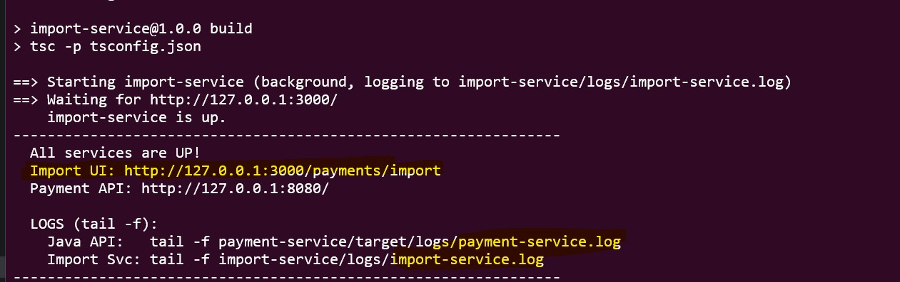
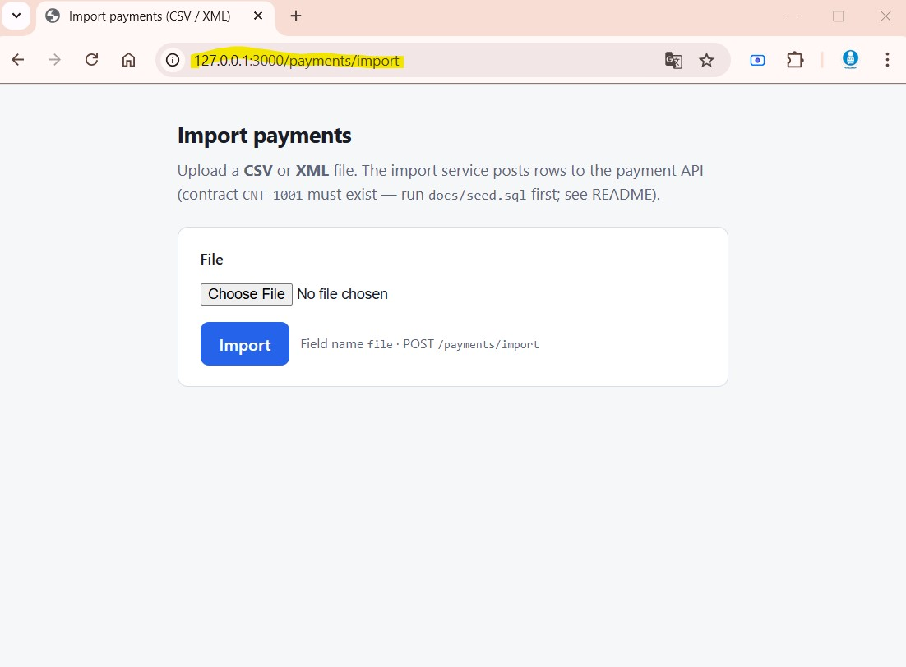
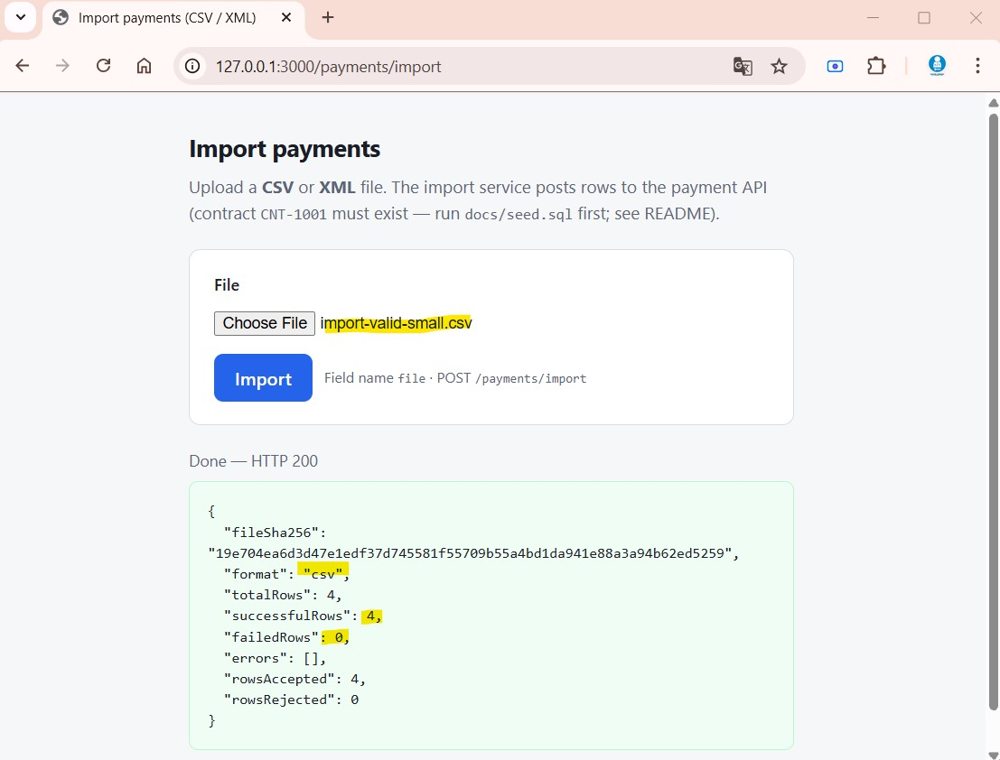
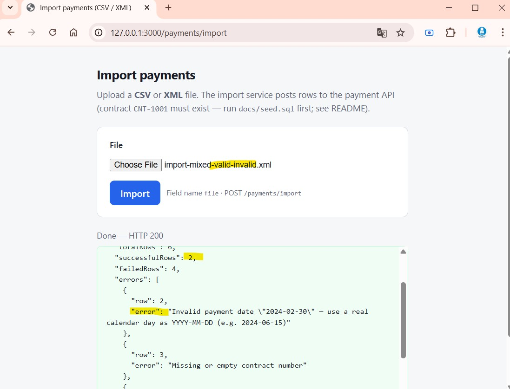
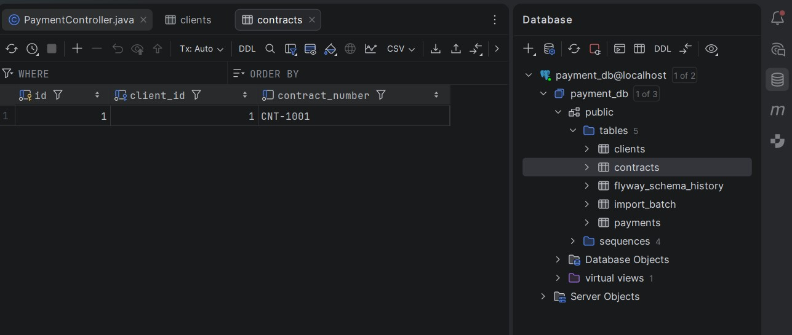
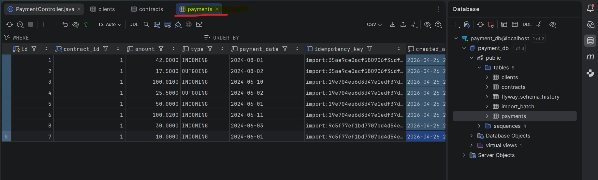

# Payment platform

Monorepo with a **Java 21 / Spring Boot** payment API (with **Lombok** for leaner Java code) and a **Node.js (TypeScript)** streaming import service. PostgreSQL is the system of record; idempotency and import deduplication are **persistent** (safe across restarts and multiple instances).

**More detail:** [docs/qa-instruction.md](docs/qa-instruction.md) — full walkthrough (after `run-all`, import via browser / Postman / `curl`, seeds, per-service run, tests & JaCoCo, ports, **npm** on shared paths, smoke test). **This README** is the **short demo map** (what to run and open first).

## Prerequisites

- JDK 21, Maven 3.9+
- Node.js 20+
- Docker (for PostgreSQL)
- Bash (Linux, macOS, or Git Bash on Windows) for the helper scripts below

## Bash scripts (`scripts/`)

| Script                        | Purpose                                                                                                                       |
| ----------------------------- | ----------------------------------------------------------------------------------------------------------------------------- |
| `scripts/build.sh`            | Build both: Maven `package` + `npm run build` (import `dist/`).                                                               |
| `scripts/run-all.sh`          | Postgres + payment-service (background) + idempotent `docs/seed.sql` if needed + import-service (foreground). `Ctrl+C` stops. |
| `scripts/run-payment-service.sh` | Payment API only; Postgres must be running.                                                                                   |
| `scripts/run-import-service.sh` | Import service only (`PORT`, `PAYMENT_API_BASE_URL`).                                                                         |
| `scripts/kill-dev-ports.sh`   | Free ports (default 3000, 8080); uses `fuser` or `lsof`.                                                                      |
| `scripts/cleanup.sh`          | **Destructive** reset: `down -v`, `mvn clean`, drop `dist/`/logs; optional `CLEAN_NODE_MODULES=1`.                            |
| `scripts/smoke-test.sh`       | Quick curl smoke (H2 + no Docker); limited vs real stack — prefer `run-all.sh`.                                               |


**:3000 refused?** Start import separately: `./scripts/run-import-service.sh` or `run-all.sh` (not the same as Java on 8080).

Quick start:

```bash
chmod +x scripts/*.sh
./scripts/build.sh
./scripts/run-all.sh
```

## Demo (first sight)

1. **Build and run** — `./scripts/build.sh` then `./scripts/run-all.sh` (import-service stays in the **foreground**; `**Ctrl+C`** stops it and the background Java process).
2. **Open** (order matters for a quick check): **[Health](http://localhost:8080/actuator/health)** → **[Import UI](http://localhost:3000/payments/import)** → **[Swagger](http://localhost:8080/swagger-ui.html)**.
3. **Contract `CNT-1001`** — seeded automatically when missing (after the API is healthy). **Step-by-step** `curl`, Postman, browser, manual seed, `cleanup.sh`, and running services without `run-all`: [docs/qa-instruction.md](docs/qa-instruction.md) (anchors `#qa-demo-walkthrough`, `#import-a-file`).

## Service URLs (local defaults)

After `**./scripts/run-all.sh**` (demo seed when **CNT-1001** is missing). **Order** ≈ what to try first: **health** → **import** → **API docs** → **example data** → **service roots** → **metrics**.


| URL                                                                                                                    | Description                                                                        |
| ---------------------------------------------------------------------------------------------------------------------- | ---------------------------------------------------------------------------------- |
| [http://localhost:8080/actuator/health](http://localhost:8080/actuator/health)                                         | Health (used by `run-all.sh`).                                                     |
| [http://localhost:3000/payments/import](http://localhost:3000/payments/import)                                         | **Import** — browser upload CSV/XML (**POST** field `**file`**).                   |
| [http://localhost:8080/swagger-ui.html](http://localhost:8080/swagger-ui.html)                                         | OpenAPI / Swagger — try `**/api/v1`** in the browser.                              |
| [http://localhost:8080/api/v1/contracts/by-number/CNT-1001](http://localhost:8080/api/v1/contracts/by-number/CNT-1001) | Example contract JSON (`**run-all.sh`** or `**docs/seed.sql**`).                   |
| [http://localhost:8080/api/v1/contracts/1/payments](http://localhost:8080/api/v1/contracts/1/payments)                 | List payments for contract **1** (demo data).                                      |
| [http://localhost:8080/](http://localhost:8080/)                                                                       | **payment-service** — JSON overview (`health`, `docs`, `api`).                     |
| [http://localhost:3000/](http://localhost:3000/)                                                                       | **import-service** — JSON overview (import routes, metrics link, payment API URL). |
| [http://localhost:8080/actuator/prometheus](http://localhost:8080/actuator/prometheus)                                 | Prometheus (Java).                                                                 |
| [http://localhost:3000/metrics](http://localhost:3000/metrics)                                                         | Prometheus (import-service).                                                       |


REST API base path: `**/api/v1`** (see Swagger).

## Tests

```bash
cd payment-service && mvn test
cd import-service && npm test
```

**payment-service — test coverage** (JaCoCo after `mvn test` in `payment-service/`; default run, without `PaymentApiIntegrationTest`). Latest numbers: `payment-service/target/site/jacoco/index.html` · `payment-service/target/site/jacoco/jacoco.xml`.


| Package                                | Code coverage | Branch coverage |
| -------------------------------------- | ------------- | --------------- |
| **Overall**                            | 95%           | 75%             |
| com.example.shared.config              | 100%          | 100%            |
| com.example.shared.error               | 100%          | 100%            |
| com.example.payment.service.impl       | 93%           | 87%             |
| com.example.payment.web.filter         | 83%           | 50%             |
| com.example.payment                    | 37%           | —               |
| com.example.payment.web.rest           | 99%           | 83%             |
| com.example.payment.dto                | 100%          | —               |
| com.example.payment.domain.enumeration | 100%          | —               |
| com.example.payment.mapper             | 100%          | —               |
| com.example.payment.exception          | 100%          | —               |


**Integration tests (optional, needs Docker):** `mvn test -Pintegration-tests` also runs `[PaymentApiIntegrationTest](payment-service/src/test/java/com/example/payment/PaymentApiIntegrationTest.java)`. If tests fail or the report is missing, run `mvn -f payment-service/pom.xml jacoco:report`. More: [docs/qa-instruction.md — Tests and coverage](docs/qa-instruction.md#tests-and-coverage-detail).

## AI-assisted development

This section is **optional transparency** (e.g. portfolio): how much of the work was produced with an **AI coding assistant** in an iterative, prompt-driven way, and **what you did** to own the result. Percentages are **approximate**—update them as the codebase evolves.

**Tools used:** **Cursor Composer 2** with **Google Gemini** (assistant in Cursor). Iteration, prompts, and merges were still **reviewed** by the author.


| Area                                     | Approx. % AI-assisted | AI actions                                                                   |
| ---------------------------------------- | --------------------- | ---------------------------------------------------------------------------- |
| `payment-service/src/main/java`          | ~20%                  | Refactors, hardening, and incremental improvements (mostly manual, reviewed) |
| `docs/`                                  | ~50%                  | Review                                                                       |
| `import-service/`                        | ~65%                  | Create, Refactor                                                             |
| `payment-service/src/test`               | ~70%                  | Create                                                                       |
| `samples/`                               | ~100%                 | Create                                                                       |
| `scripts/`                               | ~30%                  | Refactor                                                                     |
| `README.md`                              | ~30%                  | Rephrase                                                                     |


## Roadmap

**Workflow:** mark **Status** as you go: **Todo** → **In Progress** → **Done**.

### Legend — what “scope” means


|                            | Meaning                                                                                                                                                  |
| -------------------------- | -------------------------------------------------------------------------------------------------------------------------------------------------------- |
| ✅ **Shipped**              | Implemented in this repository (code + config path exists).                                                                                              |
| ⬜ **Planned**              | In scope for **hardening / next delivery**; not optional fantasy work — still a concrete backlog item.                                                   |
| 🔵 **Future architecture** | **Not** in the current codebase: evolution path (queue/workers/durable pipelines, clear separation so reviewers do not expect it in a short assignment). |


**Theme index (no duplicate detail — see tables below):** **CI/CD** → **#003** + **#014**; **observability** → **#013** (distributed tracing) + **#016** (structured, safe logs); **modularity** → **#017**; **import at scale (same synchronous pipeline)** → **#011** (shipped controls) + **#012** (verify streaming, memory, backpressure); **import business deduplication (same payment, different file bytes)** → **#023**; **when the sync HTTP import path is not viable long-term** → **#004** (Future architecture: durable async jobs — see section below). |

### P0 — Core production (must-haves: gaps in security & verification)

*Shipped for business functionality: **#000**, **#001** (see table). **#002** and **#003** are the remaining P0 blockers. None of the “Future architecture” work belongs here—see **#004** separately.*


| #   | Task                                                                                                                                                       | Scope   | Status |
| --- | ---------------------------------------------------------------------------------------------------------------------------------------------------------- | ------- | ------ |
| 000 | Core platform: Spring Boot payment API, Node import service, PostgreSQL, Flyway, DTOs + mapper, Strategy/Factory parsers                                   | Shipped | ✅ Done |
| 001 | Persistent idempotency: payment `Idempotency-Key` (contract-scoped), import batch dedup by `file_sha256`                                                   | Shipped | ✅ Done |
| 002 | Security: authentication/authorization, secrets outside defaults, actuator restricted by profile/environment                                               | Planned | ⬜ Todo |
| 003 | CI: run `mvn test -Pintegration-tests` with Docker (or equivalent) so Testcontainers-backed tests are not skipped silently (usually a job inside **#014**) | Planned | ⬜ Todo |


### Future architecture (evolution — not part of the current system)

*As implemented, import runs **in-process** in **import-service**; payment API is request/response. The items here describe a **distributed, job-based** next step, not a missing line in the current P0 spec.*


| #   | Task                                                                                                                                                                                                                                                                                                                                                                                                                                                                                                                                                                                                       | Scope     | Status |
| --- | ---------------------------------------------------------------------------------------------------------------------------------------------------------------------------------------------------------------------------------------------------------------------------------------------------------------------------------------------------------------------------------------------------------------------------------------------------------------------------------------------------------------------------------------------------------------------------------------------------------- | --------- | ------ |
| 004 | **Durable async import jobs (queue + persistent state)** — for large or long-running files, move work off the synchronous `POST /payments/import` path: **enqueue** an import job, process in **worker** process(es), **persist** job status / progress / partial results in PostgreSQL (or equivalent), support **retries** and **idempotent** restarts, expose **pollable** job status (and optional webhooks). The current design runs import **inline** in **import-service** (fine for smaller files and dev setups; **not** ideal for very large files, strict request timeouts, or crash recovery). | 🔵 Future | ⬜ Todo |


### P1 — Important hardening (observability, delivery, code health)


| #   | Task                                                                                                                                                                                                                                                                                                                                        | Scope   | Status |
| --- | ------------------------------------------------------------------------------------------------------------------------------------------------------------------------------------------------------------------------------------------------------------------------------------------------------------------------------------------- | ------- | ------ |
| 010 | Cluster-wide rate limiting: gateway **or** Redis-backed Bucket4j (see `docs/architecture.md`; in-app filter is per-JVM)                                                                                                                                                                                                                     | Planned | ⬜ Todo |
| 011 | Import: bounded row concurrency + `IMPORT_ROW_*` (see config)                                                                                                                                                                                                                                                                               | Shipped | ✅ Done |
| 012 | **(Advanced) Backpressure / huge files** — keep parsers **streaming** (not whole file in memory); `IMPORT_ROW_*` + payment API must keep up; document operational limits. If the **synchronous** import path is insufficient as a *product* requirement, the evolution is **#004** (durable async jobs), not a tweak inside this row alone. | Planned | ⬜ Todo |
| 013 | Tracing: **distributed-tracing** SDK + exporter (request/trace headers already propagated Java ↔ Node)                                                                                                                                                                                                                                      | Planned | ⬜ Todo |
| 014 | **CI/CD pipeline** (e.g. GitHub / GitLab): PR + main — verify both stacks (`mvn -B verify`, `mvn test -Pintegration-tests` with Docker, `npm ci && npm test` in import-service), dependency caching, required status checks. Optional: Docker image build/push, deploy stage                                                                | Planned | ⬜ Todo |
| 015 | **Test coverage** — raise JaCoCo (remaining controllers, filters, `GlobalExceptionHandler`); run IT profile in CI (**#003** / **#014**); optional stricter line/branch gate; more Vitest (parsers, `paymentClient`)                                                                                                                         | Planned | ⬜ Todo |
| 016 | **Structured logging** — sanitize/omit sensitive data first, then one JSON log contract per service, align import ↔ Java, sensible levels, quiet tests (aligns with **observability** in the theme index)                                                                                                                                   | Planned | ⬜ Todo |
| 017 | **Layout + `shared/`** — clearer domain / application / infrastructure boundaries in both services; `shared/` for errors, config, logging helpers; keep API error shapes consistent; do not duplicate business rules                                                                                                                        | Planned | ⬜ Todo |


### P2 — Nice to have (performance & API ergonomics)


| #   | Task                                                                                                                                                                                                                                                                                        | Scope   | Status |
| --- | ------------------------------------------------------------------------------------------------------------------------------------------------------------------------------------------------------------------------------------------------------------------------------------------- | ------- | ------ |
| 020 | Bulk/batch payment API or per-import contract cache (fewer HTTP round-trips per row)                                                                                                                                                                                                        | Planned | ⬜ Todo |
| 021 | SLO / resilience tests: very large files, concurrent imports, fault injection on payment API                                                                                                                                                                                                | Planned | ⬜ Todo |
| 022 | **Paginated** `GET /api/v1/contracts/{contractId}/payments`: cursor or keyset (`paymentDate` + `id`), **max page size** cap; index on `(contract_id, payment_date DESC, id DESC)` for large histories                                                                                       | Planned | ⬜ Todo |
| 023 | **Import business deduplication** — idempotency is `file_sha256` + `import:{hash}:row:{i}`; **changing the file** creates new payments even if business data repeats. Define a product rule (natural key, stable row idempotency, or `UNIQUE` constraint), update Java/import-service/docs. | Planned | ⬜ Todo |


## Documentation

- `**docs/`** — architecture, ER diagram (Mermaid), idempotency; see `[docs/api.md](docs/api.md)`.
- `**[docs/import-flow-node-vs-java.md](docs/import-flow-node-vs-java.md)`** — import end-to-end: who receives the file, where SHA-256 is computed, where parsing runs, and what Java sees (no raw file upload to the JVM).
- `**[docs/CHEAT-SHEET.md](docs/CHEAT-SHEET.md)`** — one-page: ports, env, `curl`, scripts, Mermaid; complements `[docs/architecture.md](docs/architecture.md)`.
- `**samples/**` — additional CSV/XML imports (valid, camelCase headers, mixed invalid rows, larger CSV).
- `**[docs/qa-instruction.md](docs/qa-instruction.md)**` — **full local manual** (import steps, per-service run, tests & coverage, ports, smoke test). `**README.md`** stays a short **demo** overview.

## Screenshots

| | | |
| :---: | :---: | :---: |
|  |  |  |
|  |  |  |

