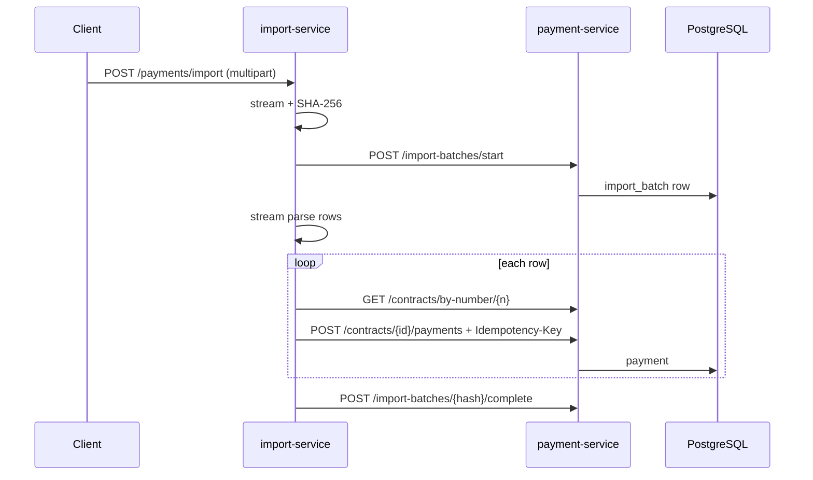
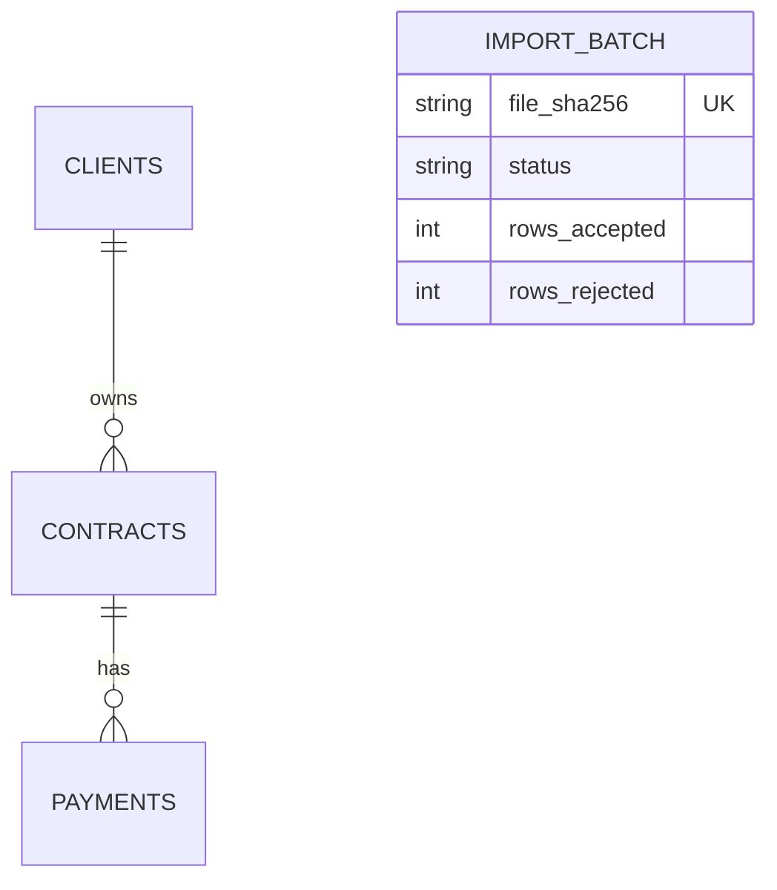

# Local dev cheat sheet

One-page reference: **ports**, **env**, **curl**, **scripts**, and **Mermaid** diagrams for whiteboard practice. Complements [`architecture.md`](architecture.md) and [`api.md`](api.md).

---

## Ports & URLs

| Service | Port | Base URL |
|---------|------|----------|
| payment-service (Spring) | 8080 | http://localhost:8080 |
| import-service (Node) | 3000 | http://localhost:3000 |
| PostgreSQL (Docker) | 5432 | `localhost:5432` → DB `payment_db`, user `user` |

**Handy paths**

- Health: `GET http://localhost:8080/actuator/health`
- Swagger: `http://localhost:8080/swagger-ui.html`
- Prometheus (Java): `GET http://localhost:8080/actuator/prometheus`
- Import UI: `http://localhost:3000/payments/import`
- Import metrics: `GET http://localhost:3000/metrics`

**Demo contract (after seed / `run-all.sh`)**

- `GET http://localhost:8080/api/v1/contracts/by-number/CNT-1001` → expect `"id": 1`

---

## Environment variables

### payment-service (typical)

| Variable | Default / notes |
|----------|-----------------|
| `DATABASE_URL` | `jdbc:postgresql://localhost:5432/payment_db` |
| `DATABASE_USER` | `user` |
| `DATABASE_PASSWORD` | `pass` |
| `SERVER_PORT` | `8080` |
| `RATE_LIMIT_CAPACITY` | `120` (Bucket4j) |
| `RATE_LIMIT_REFILL_PER_MINUTE` | `120` |

### import-service (`import-service/src/config.ts`)

| Variable | Default |
|----------|---------|
| `PORT` | `3000` |
| `PAYMENT_API_BASE_URL` | `http://localhost:8080` |
| `AXIOS_RETRIES` | `4` |
| `AXIOS_TIMEOUT_MS` | `30000` |
| `IMPORT_ROW_CONCURRENCY` | `5` |
| `IMPORT_ROW_BATCH_HIGH_WATER` | `256` |

---

## Docker & DB

```bash
docker compose up -d postgres
docker compose exec -T postgres psql -U user -d payment_db < docs/seed.sql
```

**PowerShell:** `Get-Content docs/seed.sql -Raw | docker compose exec -T postgres psql -U user -d payment_db`

---

## Scripts (repo root)

```bash
chmod +x scripts/*.sh
./scripts/build.sh
./scripts/run-all.sh              # Postgres + payment (bg) + auto-seed if needed + import (fg)
./scripts/run-payment-service.sh
./scripts/run-import-service.sh
./scripts/kill-dev-ports.sh       # free 3000 / 8080 (Linux/macOS/Git Bash)
```

---

## curl snippets

```bash
# Contract
curl -s http://localhost:8080/api/v1/contracts/by-number/CNT-1001

# List payments
curl -s http://localhost:8080/api/v1/contracts/1/payments

# Create payment (idempotent replay → 200)
curl -X POST http://localhost:8080/api/v1/contracts/1/payments \
  -H "Idempotency-Key: demo-001" \
  -H "Content-Type: application/json" \
  -d '{"clientId":1,"amount":"50.00","type":"INCOMING","paymentDate":"2024-06-01"}'

# Import file (field name must be file)
curl -X POST http://localhost:3000/payments/import -F "file=@samples/import-valid-small.csv;type=text/csv"
```

---

## Import flow (Mermaid — whiteboard)



---

## ER sketch (Mermaid — whiteboard)



*(Full columns: see `docs/architecture.md`.)*

---

## HTTP status quick reference (this repo)

| Status | Typical meaning |
|--------|------------------|
| 200 | OK; idempotent **payment** replay |
| 201 | Payment created |
| 400 | Validation / bad request |
| 404 | Contract / batch not found |
| 409 | Import batch already in progress (same hash) |
| 415 | Not CSV/XML |
| 429 | Rate limited (`RATE_LIMITED`) |
| 503 | Circuit breaker / timeout (import mapping) |

---

## Sample files

- Scenarios: `samples/*.csv`, `samples/*.xml`, `samples/import-valid-small.csv`

---

## Tests (one-liners)

```bash
cd payment-service && mvn test
cd payment-service && mvn test -Pintegration-tests
cd import-service && npm test
```
