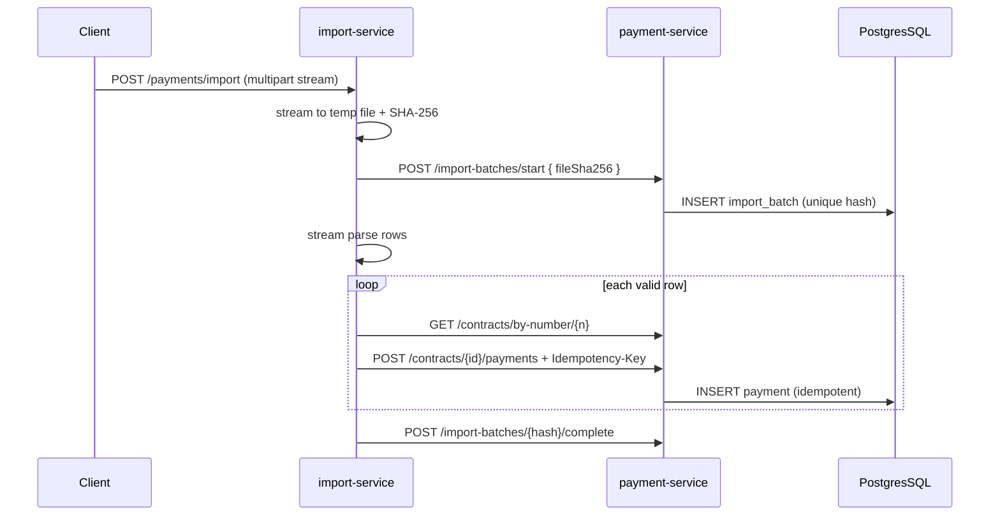
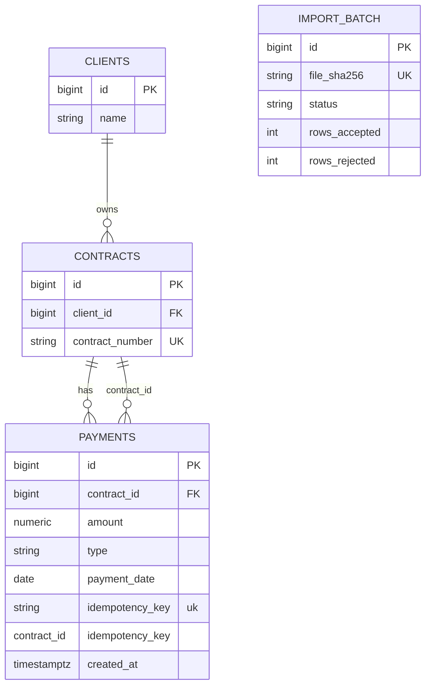

# Architecture overview

## Components

- **payment-service (Java)**: REST API, PostgreSQL via JPA, Flyway migrations, validation, idempotent payment creation, import-batch registry, rate limiting (Bucket4j), structured JSON logs (Logstash encoder), Micrometer metrics, Resilience4j circuit breaker on contract lookup by number.
- **import-service (Node/TypeScript)**: Accepts `multipart/form-data` uploads, streams bytes to disk while computing **SHA-256**, registers the hash with Java, streams parse (CSV/XML) via **Strategy** + **Factory**, validates rows, resolves `contract_number` → `contractId`, creates payments with deterministic `Idempotency-Key` values, finalizes row counts. Exposes Prometheus metrics.

## Clean architecture (Java)

`controller` → `service` → `repository` → `domain`, with **DTOs** at the edge and a **mapper** between domain and API models. Entities are never returned from controllers.

## Data flow (import)

## ER diagram

## Idempotency

- **Payment creation**: Header `Idempotency-Key` → unique **per contract** on `(contract_id, idempotency_key)` (same key may be reused on a different contract). Concurrent duplicates surface as a constraint violation; the service resolves the winner row and returns **200** for replays. No in-memory store.
- **File import**: `import_batch.file_sha256` is **unique**. Completed imports short-circuit on `POST /import-batches/start` (**200**, `alreadyProcessed: true`). Row-level keys `import:{sha256}:row:{n}` make per-row creates safe on retries.

## Transaction boundaries

- Each **payment** is created in a single `@Transactional` service method (atomic create).
- **File import** is **partial success** by design: invalid rows are skipped and counted; valid rows commit independently. This favors **availability** and operator visibility (row-level errors) over an all-or-nothing import. A full rollback would reject entire files for one bad line—usually undesirable for large bank files.

## Observability

- **Logs**: JSON to stdout with MDC `requestId`, `traceId`, and `paymentId` on create. No card or account numbers in messages.
- **Metrics**: Spring Boot Actuator + Prometheus; custom counters/timers for payment create and import finalize; Node `prom-client` for import duration and row outcomes.
- **Tracing**: `X-Trace-Id` / `X-Request-Id` propagated from import-service to payment-service (**distributed-tracing**–ready; wire a tracing SDK + exporter in production).

## Rate limiting and scaling

- **As implemented:** `RateLimitingFilter` keeps a **per-JVM** `ConcurrentHashMap` of Bucket4j buckets (keyed by `X-Forwarded-For` first hop or `remoteAddr`). Limits are **not shared** across replicas: two pods each allow the full configured rate, and a client that rotates IPs (or many distinct keys) can consume unbounded aggregate quota.
- **Sticky sessions do not fix this**: limits are local memory, not session state; the problem is **missing shared token state**, not load-balancer affinity.
- **Cluster-grade options** (pick one for production):
  1. **Edge / gateway** — Enforce rate limits at API gateway, CDN/WAF, or mesh (Envoy/Istio); simplest operationally and the usual choice for public HTTP.
  2. **Central store** — Bucket4j **Redis** (or Memcached) proxy so all instances consult the same bucket keys; tune key schema (`tenant`, `apiKey`, `ip`) deliberately.
  3. **Dedicated rate-limit service** — Only if you need complex policy beyond token buckets.
- **Operational note**: the in-process map can grow with cardinality of client keys; cap/evict or move to external store if abuse is a concern.

## Circuit breaker

`contractLookup` protects the DB path used heavily during imports; when open, callers receive **503** with a stable error body (no stack traces).

## Failure handling

- **Global `@RestControllerAdvice`**: consistent `ApiErrorResponse` without leaking stack traces to clients (errors still logged server-side).
- **Import**: downstream failures per row increment `rowsRejected`; processing continues.

## Trade-offs

- Import writes a **temp file** so we can hash then parse without loading the whole payload into RAM and without double-consuming the upload stream.
- **Contract-scoped** idempotency keeps keys from colliding across unrelated contracts while still allowing deterministic import row keys (`import:{sha256}:row:{n}`) per target contract.
